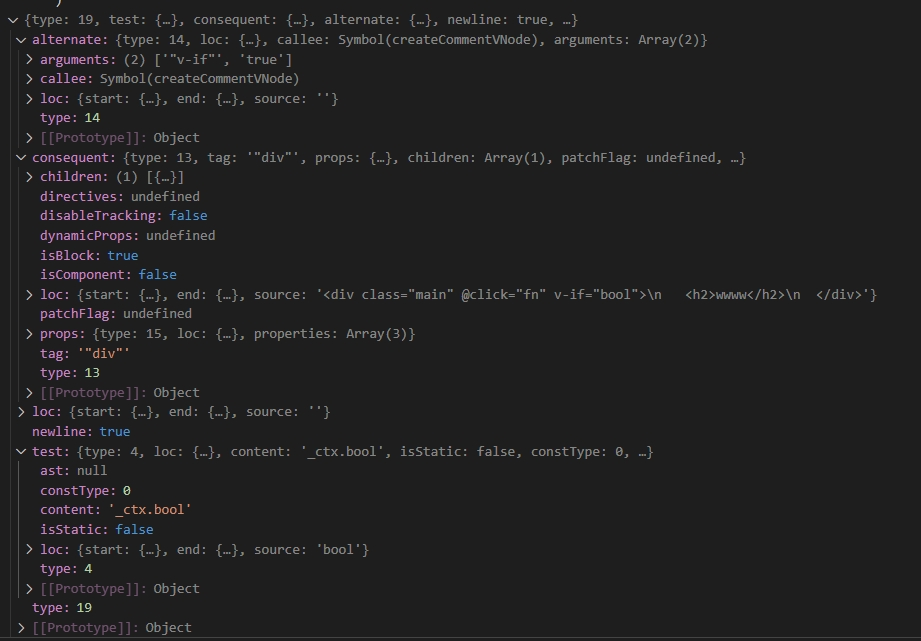

```javascript
以下是NodeTypes枚举中各个类型的简要意义：

ROOT: 表示抽象语法树的根节点。
ELEMENT: HTML元素节点。
TEXT: 纯文本内容节点。
COMMENT: 注释节点。
SIMPLE_EXPRESSION: 简单的表达式，如变量名或字面量。
INTERPOLATION: 插值表达式，用于动态插入数据到文本中。
ATTRIBUTE: 元素的属性节点。
DIRECTIVE: 指令节点，如Vue中的v-if、v-for等。
COMPOUND_EXPRESSION: 复合表达式，包含多个子表达式的组合。
容器类型：

IF: 条件渲染的if语句块。
IF_BRANCH: if条件语句内的分支。
FOR: 循环渲染节点，如v-for指令对应的结构。
TEXT_CALL: 文本调用，可能涉及文本插值的函数调用。
Codegen相关：

VNODE_CALL: 虚拟节点调用，用于创建Vue虚拟DOM节点。
JS_CALL_EXPRESSION: JavaScript函数调用表达式。
JS_OBJECT_EXPRESSION: JavaScript对象字面量表达式。
JS_PROPERTY: JavaScript对象的属性定义。
JS_ARRAY_EXPRESSION: JavaScript数组表达式。
JS_FUNCTION_EXPRESSION: JavaScript函数表达式。
JS_CONDITIONAL_EXPRESSION: JavaScript三元条件表达式。
JS_CACHE_EXPRESSION: 缓存表达式，可能用于优化重复计算。
SSR Codegen相关（服务器端渲染）：

JS_BLOCK_STATEMENT: JavaScript块语句。
JS_TEMPLATE_LITERAL: JavaScript模板字符串。
JS_IF_STATEMENT: JavaScript if语句。
JS_ASSIGNMENT_EXPRESSION: JavaScript赋值表达式。
JS_SEQUENCE_EXPRESSION: JavaScript序列表达式，执行一系列操作。
JS_RETURN_STATEMENT: JavaScript return语句。


------------------------------------------------

export function createObjectProperty(
  key: Property['key'] | string,
  value: Property['value'],
): Property {
  return {
    type: NodeTypes.JS_PROPERTY,
    loc: locStub,
    key: isString(key) ? createSimpleExpression(key, true) : key,
    value,
  }
}

//createObjectProperty返回值 Property实例
{
    'key':{
        'constType':3,
        'content':'key',
        'isStatic':true,
        'loc':{/**具体内容省略**/},
        'type':4
    },
    'loc':{/**具体内容省略**/},
    'value':{
        'constType':2,
        'content':'0',
        'isStatic':false,
        'type':4
        'loc':{/**具体内容省略**/},
    },
    'type':16
}

-----------------------------------------------------
export function createConditionalExpression(
  test: ConditionalExpression['test'],
  consequent: ConditionalExpression['consequent'],
  alternate: ConditionalExpression['alternate'],
  newline = true,
): ConditionalExpression {
  return {
    type: NodeTypes.JS_CONDITIONAL_EXPRESSION,
    test,
    consequent,
    alternate,
    newline,
    loc: locStub,
  }
}
```
* 下图是createConditionalExpression返回值 ConditionalExpression实例

