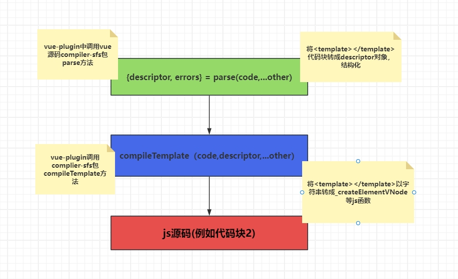

## template编译（template-compile）

template编译是从compileTemplate函数开始的，这个函数是在vue-plugin插件里面被执行的，options是它的参数，具体类型看typescript，source（template源码），id，filename是必传参数，其它非必传。最终返回编译后js代码

## template编译流程图


```javascript
export function compileTemplate(
  options: SFCTemplateCompileOptions,
): SFCTemplateCompileResults {
  const { preprocessLang, preprocessCustomRequire } = options

  const preprocessor = preprocessLang
    ? preprocessCustomRequire
      ? preprocessCustomRequire(preprocessLang)
      : __ESM_BROWSER__
        ? undefined
        : consolidate[preprocessLang as keyof typeof consolidate]
    : false
  if (preprocessor) {
    try {
      return doCompileTemplate({
        ...options,
        source: preprocess(options, preprocessor),
        ast: undefined, // invalidate AST if template goes through preprocessor
      })
    } catch (e: any) {
      return {
        code: `export default function render() {}`,
        source: options.source,
        tips: [],
        errors: [e],
      }
    }
  } else if (preprocessLang) {
    return {
      code: `export default function render() {}`,
      source: options.source,
      tips: [
        `Component ${options.filename} uses lang ${preprocessLang} for template. Please install the language preprocessor.`,
      ],
      errors: [
        `Component ${options.filename} uses lang ${preprocessLang} for template, however it is not installed.`,
      ],
    }
  } else {
    return doCompileTemplate(options)
  }
}
```

```javascript
import { 
  createElementVNode as _createElementVNode, 
  resolveComponent as _resolveComponent, 
  createVNode as _createVNode, 
  toDisplayString as _toDisplayString, 
  openBlock as _openBlock, 
  createElementBlock as _createElementBlock, 
  pushScopeId as _pushScopeId, 
  popScopeId as _popScopeId 
} from "vue"
 const _withScopeId = n => (
  _pushScopeId("data-v-4902c357"),
  n=n(),_popScopeId(),
  n
)
const _hoisted_1 = { class: "main" }
const _hoisted_2 = /*#__PURE__*/ _withScopeId(() => /*#__PURE__*/_createElementVNode("p", null, "Main.vue", -1 /* HOISTED */))
export function render(_ctx, _cache, $props, $setup, $data, $options) {
  const _component_module = _resolveComponent("module")
  return (_openBlock(), 
      _createElementBlock(
        "div", 
        _hoisted_1, 
        [
          _hoisted_2,
          _createVNode(_component_module),
          _createElementVNode(
            "code", null, _toDisplayString(_ctx.css), 1 /* TEXT */
          )
        ]
      )
    )
}
```